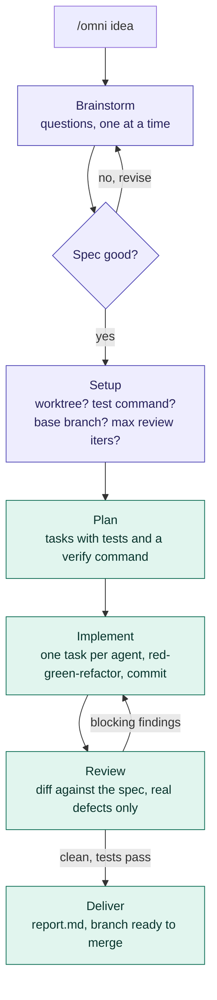
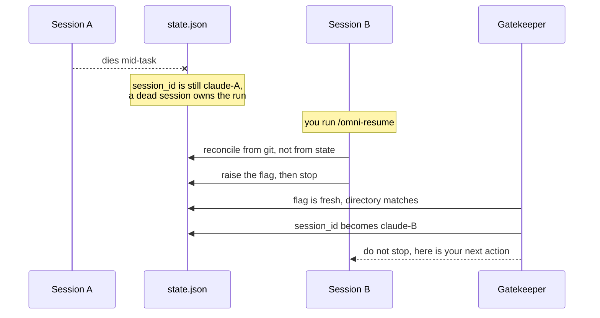

# omni

Cast once, it slashes to the end on its own. `/omni <idea>` turns an idea into a
locked spec, then plans, implements test-first, reviews and delivers on an
`omni/<feature>` branch — without asking you anything in between.

## Install

### Claude Code

```bash
claude plugin marketplace add https://github.com/himkit/omni-pipeline-plugin.git
```

```bash
claude plugin install omni@omni-pipeline-plugin
```

### opencode

omni needs more than a skills path: subagents, slash commands, and a
replacement for the Claude Code Stop hook. Clone the repo somewhere permanent,
then run the installer, which links everything (including the skill) into
`~/.config/opencode`:

```bash
./.opencode-plugin/install.sh
```

The gatekeeper becomes a plugin that re-prompts the session on `session.idle`
instead of blocking a stop, and the subagents are renamed `omni-planner` /
`omni-implementer` / `omni-reviewer` because opencode has one flat agent
namespace. Run state is shared with Claude Code in
`~/.claude/omni-plugins/runs/`. See
[`.opencode-plugin/README.md`](.opencode-plugin/README.md) for the details.

A copy of the skill that also exists in `~/.claude/skills/pipeline/` (or a path
already listed in opencode's config) shadows the one this plugin installs.
Remove the old copy if the plugin's version does not take effect.

## Commands

| Command | When |
|---|---|
| `/omni <idea>` | Start. The only command you normally type. |
| `/omni-status` | Where is it? Phase, task i/n, review iteration, branch. |
| `/omni-resume` | The session driving a run died. Take it over here. |
| `/omni-abort` | Stop a run. Optionally delete branch, worktree and run dir. |

## The run

You are asked exactly twice: approve the spec, then answer four setup
questions. After that it is hands-off until `done` or `blocked`.



Purple is you. Teal runs itself. A Stop hook keeps the session from going quiet
mid-pipeline, so the only ways out are `done`, `blocked` (with a reason you can
act on) or `/omni-abort`.

Nothing is ever pushed and no MR is opened — that call stays yours.

## When the session dies

Crash, kill, context exhaustion, a closed terminal. The run is not lost: git
holds the work and the run directory holds the state. Open a new session in the
same repo and run `/omni-resume`.



Two things make that work:

- **The gatekeeper writes `session_id`, never the model.** A session cannot read
  its own id; the hook can. So `/omni-resume` only raises a flag
  (`takeover_requested` + `takeover_cwd`) and the hook fills in the name.
- **Git is the truth.** Task commits carry their number in the scope
  (`feat(omni-task-3): ...`), so the new session reads real progress out of
  `git log` instead of trusting what the dead one meant to do. A dirty worktree
  is stashed, never discarded, and the full suite runs before anything advances.

Nothing auto-adopts a run. A session waiting twenty minutes on a subagent looks
exactly like a dead one from the outside, so taking over is always something you
ask for.

Opening a session in a directory with an unfinished run prints a one-line
reminder. `/omni-abort` is the off switch.

## Where state lives

`~/.claude/omni-plugins/runs/<date>-<repo>-<feature>/` — outside your repo, so
nothing pollutes the tree and parallel runs across repos never collide.

| File | What |
|---|---|
| `state.json` | Single source of truth: phase, task index, branch, owner |
| `spec.md` | The locked spec you approved |
| `plan.md` | Tasks, written by the planner |
| `report.md` | Written at delivery: what was built, commits, test output, how to merge |

Claude Code and opencode share this directory, so `/omni-status` in one sees
runs started by the other. A run is only resumable from the host that started
it.
