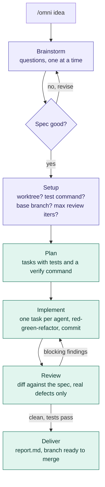
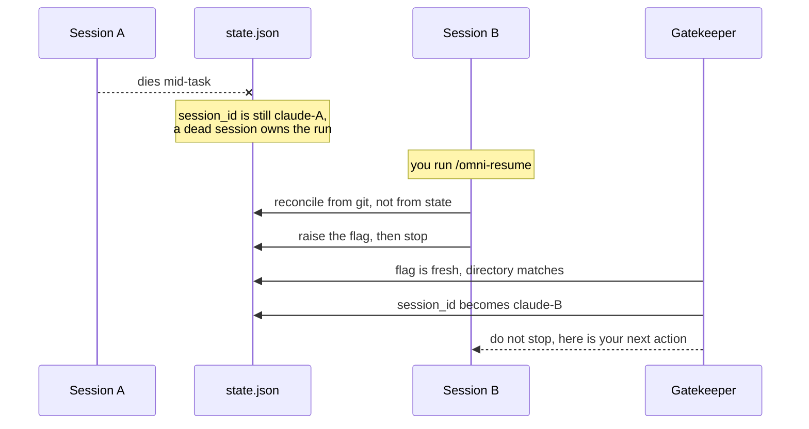

# omni

Cast once, it slashes to the end on its own. `/omni <idea>` turns an idea into a
locked spec, then plans, implements test-first, reviews and delivers on an
`omni/<feature>` branch — without asking you anything in between.

## Install

```bash
npx github:himkit/omni-pipeline-plugin
```

Pick which coding agents to wire up — Claude Code, codex, opencode — and the
installer does the rest. It clones itself to `~/.omni-pipeline/src` and points
every host at that one checkout, so re-running the command updates all of them.

| Flag | Effect |
|---|---|
| `--hosts claude,codex` | skip the picker, install into these only |
| `--yes`, `-y` | skip the picker, use every detected host |
| `--ref <ref>` | check out a specific branch or tag |
| `--uninstall` | remove host wiring; the checkout and run state stay |
| `--help`, `-h` | usage |

A host that is not on your `PATH` shows in the picker but cannot be selected,
except when uninstalling — you can always unwire a host whose binary you have
already removed. Piped or non-interactive input skips the picker and uses every
detected host. If any host fails to wire up, the installer says which and exits
non-zero, so it is safe to chain in a setup script.

`OMNI_HOME` relocates the checkout and the state the hooks resolve — it exists
primarily as the seam the test suite writes through. It does **not** relocate a
whole install on its own: the prompts hardcode the default path, so moving a
live install also means editing the paths in `skills/pipeline/SKILL.md`, the
`/omni-*` commands, and the permission globs in `.opencode-plugin/agents/omni.md`.

opencode gets more than a skills path: subagents, slash commands, and a
replacement for the Claude Code Stop hook, all symlinked from the
`~/.omni-pipeline/src` checkout into `~/.config/opencode` (honouring
`$OPENCODE_CONFIG_DIR`). The gatekeeper becomes a plugin that re-prompts the
session on `session.idle` instead of blocking a stop, and the subagents are
renamed `omni-planner` / `omni-implementer` / `omni-reviewer` because opencode
has one flat agent namespace. Run state is shared with the other hosts in
`~/.omni-pipeline/runs/`. Because the symlinks point into the checkout, editing
a file in `~/.omni-pipeline/src` takes effect in opencode immediately. See
[`.opencode-plugin/README.md`](.opencode-plugin/README.md) for the details.

A copy of the skill that also exists in `~/.claude/skills/pipeline/` (or a path
already listed in opencode's config) shadows the one this plugin installs.
Remove the old copy if the plugin's version does not take effect.

### Codex

Codex reads this plugin's `.claude-plugin/marketplace.json` directly, so
`codex plugin add` needs no codex-specific manifest. It does ignore a plugin's
own `hooks/hooks.json`, so the installer registers the gatekeeper in the
user-level `~/.codex/hooks.json` instead — written atomically, backed up before
the first change, and fenced with a `_source` key so `--uninstall` removes
exactly what it added and nothing of yours.

Its `Stop` hook is expected to block the way Claude Code's does. That is
inferred from the codex binary's own hook vocabulary and error strings
(`Stop hook returned decision:block without a non-empty reason`), not from an
observed `codex exec` run.

Only `Stop` is wired for codex. There is no `SessionStart` hook, so a codex
session does not get the "unfinished run in this directory" reminder that
Claude Code prints.

Because codex runs the same `hooks/gatekeeper.py` Claude Code does, the hook
takes its host identity from an `OMNI_HOST` environment variable, which the
installer sets to `codex` in the command it writes. Without it a codex session
would be labelled `claude-` and the ownership guard below could not tell the
two apart.

## Commands

| Command | When |
|---|---|
| `/omni <idea>` | Start. The only command you normally type. |
| `/omni-status` | Where is it? Phase, task i/n, review iteration, branch. |
| `/omni-resume` | The session driving a run died. Take it over here. |
| `/omni-abort` | Stop a run. Optionally delete branch, worktree and run dir. |

## The run

You are asked exactly twice: approve the spec, then answer four setup
questions. After that it is hands-off until `done` or `blocked`.



Purple is you. Teal runs itself. A Stop hook keeps the session from going quiet
mid-pipeline, so the only ways out are `done`, `blocked` (with a reason you can
act on) or `/omni-abort`.

Nothing is ever pushed and no MR is opened — that call stays yours.

## When the session dies

Crash, kill, context exhaustion, a closed terminal. The run is not lost: git
holds the work and the run directory holds the state. Open a new session in the
same repo and run `/omni-resume`.



Two things make that work:

- **The gatekeeper writes `session_id`, never the model.** A session cannot read
  its own id; the hook can. So `/omni-resume` only raises a flag
  (`takeover_requested` + `takeover_cwd`) and the hook fills in the name.
- **Git is the truth.** Task commits carry their number in the scope
  (`feat(omni-task-3): ...`), so the new session reads real progress out of
  `git log` instead of trusting what the dead one meant to do. A dirty worktree
  is stashed, never discarded, and the full suite runs before anything advances.

Nothing auto-adopts a run. A session waiting twenty minutes on a subagent looks
exactly like a dead one from the outside, so taking over is always something you
ask for.

Opening a session in a directory with an unfinished run prints a one-line
reminder. `/omni-abort` is the off switch.

## Where state lives

`~/.omni-pipeline/runs/<date>-<repo>-<feature>/` — outside your repo, so
nothing pollutes the tree and parallel runs across repos never collide.

| File | What |
|---|---|
| `state.json` | Single source of truth: phase, task index, branch, owner |
| `spec.md` | The locked spec you approved |
| `plan.md` | Tasks, written by the planner |
| `report.md` | Written at delivery: what was built, commits, test output, how to merge |

Worktrees the pipeline creates for itself live beside it, in
`~/.omni-pipeline/worktrees/<run-id>/`.

All three hosts share this directory, so `/omni-status` in one sees runs started
by the others. A run is only resumable from the host that started it: each host
prefixes the session ids it writes (`claude-`, `codex-`, `opencode-`), and the
gatekeepers refuse a takeover across that boundary.

Upgrading from a version that stored state in `~/.claude/omni-plugins/`? Move
your runs once — there is no automatic migration:

    mkdir -p ~/.omni-pipeline && mv ~/.claude/omni-plugins/runs ~/.omni-pipeline/runs

That leaves an empty `~/.claude/omni-plugins/worktrees/` behind. Delete it once
no run is using it; the pipeline creates worktrees under the new path from now
on.

`OMNI_HOME` moves this directory and the checkout for the hooks and the
installer. The prompts do not read it, so see the note under
[Install](#install) before relocating a live install.
