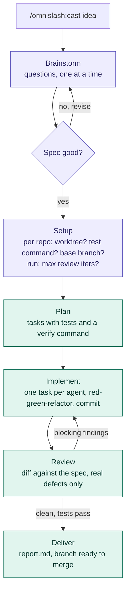
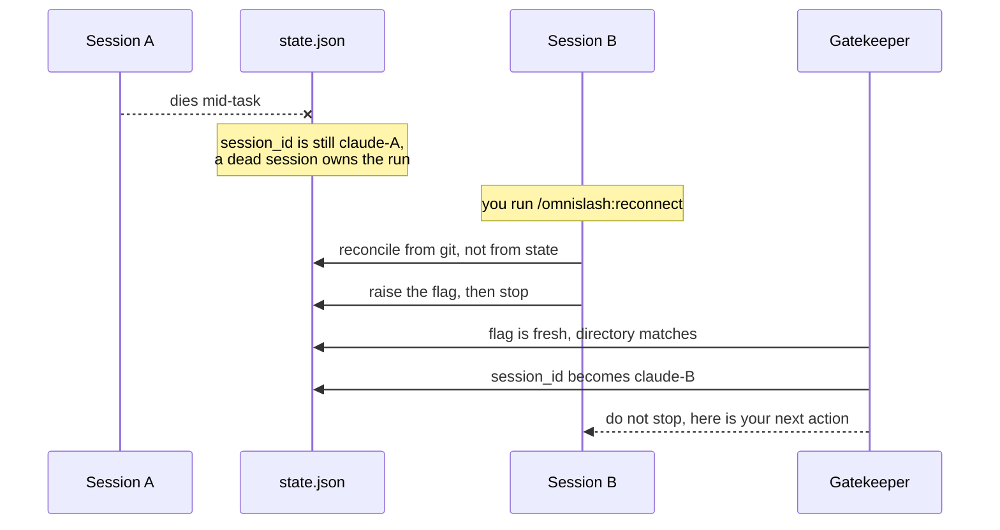

# omnislash

Cast once, it slashes to the end on its own. `/omnislash:cast <idea>` turns an idea into a
locked spec, then plans, implements test-first, reviews and delivers on an
`omni/<feature>` branch — without asking you anything in between.

## Install

Installation differs by host. If you use more than one, install omnislash in each.
Every host installs from this repository through its own plugin mechanism;
nothing is written into your config directory by hand.

### Claude Code

```text
/plugin marketplace add himkit/omni-pipeline-plugin
/plugin install omnislash@omni-pipeline-plugin
```

### Codex

```bash
codex plugin marketplace add himkit/omni-pipeline-plugin
codex plugin add omnislash@omni-pipeline-plugin
```

Codex loads the plugin's `hooks/hooks-codex.json`, so the gatekeeper's Stop
hook and the session-start reminder run without touching `~/.codex/hooks.json`.
Subagents need `multi_agent = true` under `[features]` in `~/.codex/config.toml`;
without it the orchestrator does each role inline. Codex has no slash-command
surface for plugins — ask for the `cast` skill with the intent
(`scoreboard`, `reconnect`, `gg`).

### Hermes Agent

```bash
hermes plugins install himkit/omni-pipeline-plugin
hermes plugins enable omni-pipeline-plugin/.hermes-plugin
```

The adapter lives in `.hermes-plugin/` inside the clone, so the id to enable is
the nested one — `hermes plugins list` shows it as `omnislash`.

Hermes has no Stop hook, so the plugin runs the same gatekeeper at `pre_verify`
— the gate just before the agent accepts a final answer — and the session-start
reminder at `pre_llm_call`. That gate fires only on a turn where the agent
edited code, and Hermes caps consecutive continues per turn, so raise the cap
and let the gatekeeper's own safety valve be the bound:

```bash
hermes config set agent.max_verify_nudges 20
```

Subagents go through `delegate_task` with `agents/<role>.md` as the prompt.
Hermes has no slash-command surface for a plugin's prompts — load the skill
namespaced (`skill_view("omnislash:cast")`) or ask for the `cast` skill with
the intent (`scoreboard`, `reconnect`, `gg`).

### opencode

Add to the `plugin` array in `opencode.json` and restart:

```json
{ "plugin": ["omni-pipeline@git+https://github.com/himkit/omni-pipeline-plugin.git"] }
```

The plugin registers the `omnislash` agent, the `omnislash-planner` / `omnislash-implementer`
/ `omnislash-reviewer` subagents, the `/omnislash:*` commands and the `cast` skill,
and re-prompts the session on `session.idle` in place of a Stop hook. Pin with
`#v1.0.0`.

### Any other host

```bash
npx skills add himkit/omni-pipeline-plugin
```

Skills-only: no gatekeeper and no subagents. The skill re-reads `state.json`
every turn and does each role inline. See [`hosts/README.md`](hosts/README.md)
for the full matrix, what each tier loses, and how to add a host.

A copy of the skill that also exists in `~/.claude/skills/cast/` (or a path
already listed in opencode's config) shadows the one this plugin installs.
Remove the old copy if the plugin's version does not take effect.

## Commands

| Command | When |
|---|---|
| `/omnislash:cast <idea>` | Start. The only command you normally type. |
| `/omnislash:scoreboard` | Where is it? Phase, task i/n, review iteration, branch. |
| `/omnislash:reconnect` | The session driving a run died. Take it over here. |
| `/omnislash:gg` | Stop a run. Optionally delete branches, worktrees and run dir. |

## The run

You are asked exactly twice: approve the spec, then answer the setup
questions. After that it is hands-off until `done` or `blocked`.



Purple is you. Teal runs itself. A Stop hook keeps the session from going quiet
mid-pipeline, so the only ways out are `done`, `blocked` (with a reason you can
act on) or `/omnislash:gg`.

Nothing is ever pushed and no MR is opened — that call stays yours.

## When the session dies

Crash, kill, context exhaustion, a closed terminal. The run is not lost: git
holds the work and the run directory holds the state. Open a new session in the
same repo and run `/omnislash:reconnect`.



Two things make that work:

- **The gatekeeper writes `session_id`, never the model.** A session cannot read
  its own id; the hook can. So `/omnislash:reconnect` only raises a flag
  (`takeover_requested` + `takeover_cwd`) and the hook fills in the name.
- **Git is the truth.** Task commits carry their number in the scope
  (`feat(omni-task-3): ...`), so the new session reads real progress out of
  `git log` instead of trusting what the dead one meant to do. A dirty worktree
  is stashed, never discarded, and the full suite runs before anything advances.

Nothing auto-adopts a run. A session waiting twenty minutes on a subagent looks
exactly like a dead one from the outside, so taking over is always something you
ask for.

Opening a session in a directory with an unfinished run prints a one-line
reminder. `/omnislash:gg` is the off switch.

## Where state lives

`~/.omni-pipeline/runs/<date>-<repo>-<feature>/` — outside your repo, so
nothing pollutes the tree and parallel runs across repos never collide.

| File | What |
|---|---|
| `state.json` | Single source of truth: phase, task index, branch, owner |
| `spec.md` | The locked spec you approved |
| `plan.md` | Tasks, written by the planner |
| `report.md` | Written at delivery: what was built, commits, test output, how to merge |

Worktrees the pipeline creates for itself live beside it, in
`~/.omni-pipeline/worktrees/<run-id>/`.

A feature that spans repositories is still one run. Each repository is a
*target* with its own isolation mode, branch, base branch and test command,
listed under `targets` in `state.json`; one spec and one plan drive all of
them, every plan task names the target it touches, and the reviewer diffs
each. Worktrees then live at `~/.omni-pipeline/worktrees/<run-id>/<target>`.
Targets are fixed when the run is set up — the gatekeeper answers to a session
opened in any of them, and `/omnislash:reconnect` works from whichever one you are in.

Every full-tier host shares this directory, so `/omnislash:scoreboard` in one sees runs started
by the others. A run is only resumable from the host that started it: each host
prefixes the session ids it writes (`claude-`, `codex-`, `hermes-`,
`opencode-`), and the gatekeepers refuse a takeover across that boundary.

Upgrading from a version that stored state in `~/.claude/omni-plugins/`? Move
your runs once — there is no automatic migration:

    mkdir -p ~/.omni-pipeline && mv ~/.claude/omni-plugins/runs ~/.omni-pipeline/runs

That leaves an empty `~/.claude/omni-plugins/worktrees/` behind. Delete it once
no run is using it; the pipeline creates worktrees under the new path from now
on.

`OMNI_HOME` moves this directory for the hooks and the test suite. The prompts
hardcode `~/.omni-pipeline`, so relocating a live install also means editing
the paths in `skills/cast/SKILL.md`, the `/omnislash:*` commands, and the
`external_directory` permission in `.opencode/src/omni.ts`.
